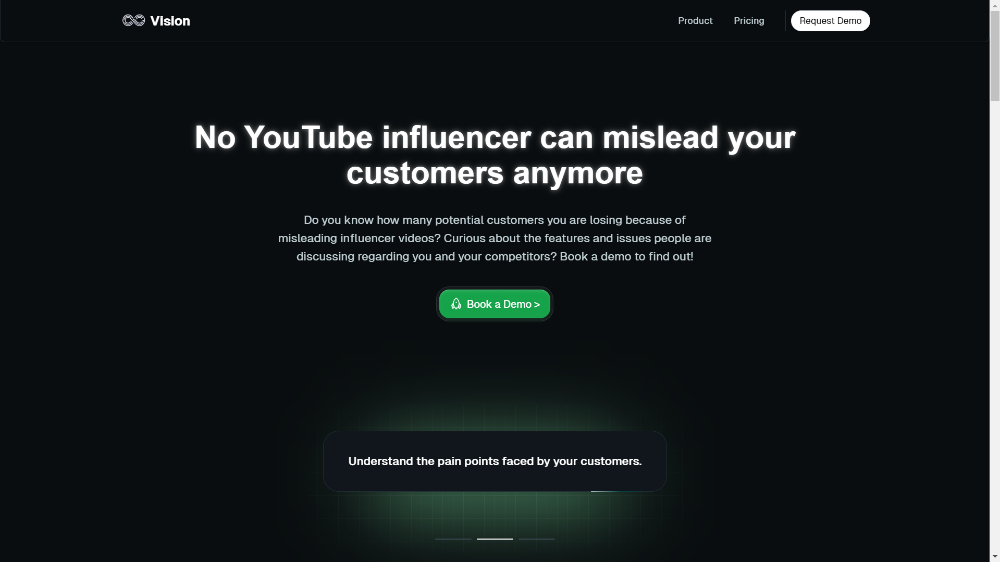
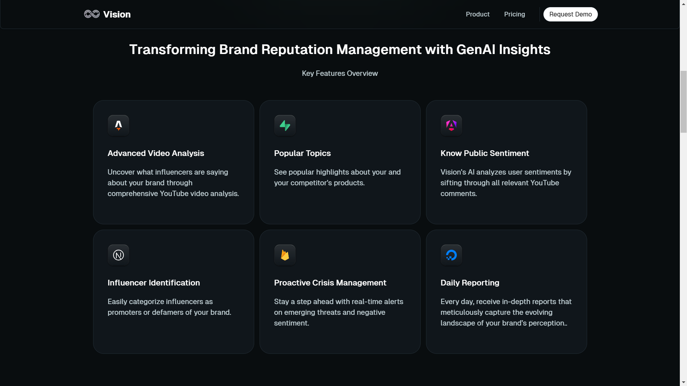
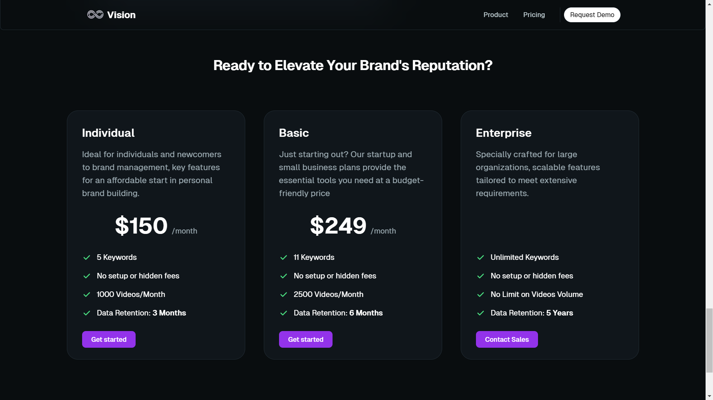

# Nexicorn AI: Vision - Your Brand Protector

## Transforming Brand Reputation Management with GenAI Insights

Welcome to Nexicorn AI's Vision, the ultimate solution for brand reputation management powered by Generative AI. Vision is revolutionizing the industry, offering unparalleled insights and protection for your brand's reputation. 







## Our Mission

At Nexicorn AI, our mission with Vision is to safeguard the reputation of every brand with cutting-edge Generative AI technology. Vision stands as the leader in its field, boasting twelve times the power of its closest competitors. In today's digital landscape, every brand requires an AI agent for each layer of their data, and Vision aims to fulfill that need comprehensively.

## Features

### Advanced Video Analysis
Uncover insights from influencers through comprehensive analysis of YouTube videos.

### Popular Topics
Discover popular highlights about your products and those of your competitors.

### Public Sentiment Analysis
Vision's AI sifts through relevant YouTube comments to analyze user sentiments effectively.

### Influencer Identification
Effortlessly categorize influencers as promoters or detractors of your brand.

### Proactive Crisis Management
Stay ahead of the curve with real-time alerts on emerging threats and negative sentiment.

### Daily Reporting
Receive detailed reports capturing the evolving landscape of your brand’s perception, delivered to you every day.

## Social Media

Connect with us on LinkedIn: [Nexicorn](https://www.linkedin.com/company/nexicorn/)

## Build Setup

To get started with Nexicorn AI's Vision, follow these steps:

```bash
# Install dependencies
$ npm install

# Serve with hot reload at localhost:3000
$ npm run dev

# Build for production and launch server
$ npm run build

# Preview production
$ npm run preview
